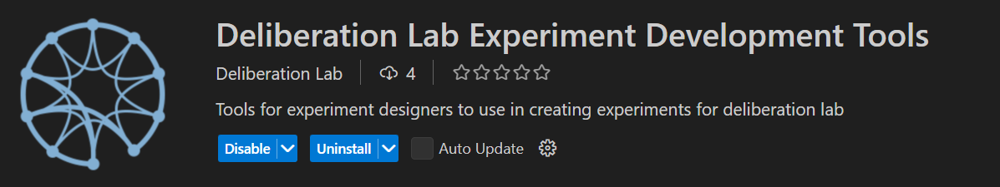
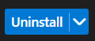
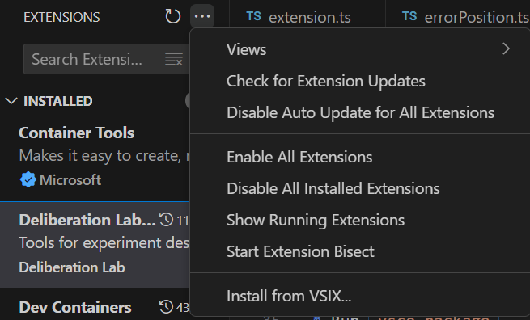
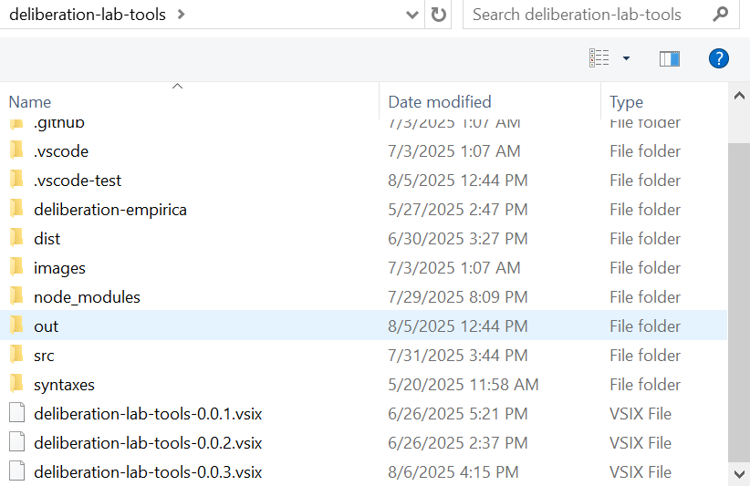

# How to develop your VSCode Extension

## What's in the folder

* This folder contains all of the files necessary for your web extension.
* `package.json` * this is the manifest file in which you declare your extension and command.
* `src/web/extension.ts` * this is the main file for the browser
* `webpack.config.js` * the webpack config file for the web main

## Cloning the repository

* git clone https://github.com/Watts-Lab/deliberation-lab-tools.git
* cd deliberation-lab-tools

## Setup

* Install Node.JS and VSCode
* Open the repository in a VSCode workspace

## Install Dependencies

* Run `npm install`.
* Run `npm install -g vsce` to install vsce CLI

## Branching to create new feautures

* When working on a new feature, run `git checkout -b [your-feature-name]`

## Packaging the extension for demoing

* Uninstall the existing version of your extension:
  * 
  * 
* Run `vsce package`
* Install newly packaged extension in one of two ways:
  * Run `code --install-extension [.vsix file generated above]`
  * Or go to extensions sidebar and press three dots on top right corner
  * Click on 'Install from VSIX...' and select your newly packaged extension (found in deliberation-lab-tools folder):
    * 
    * 
* Restart VSCode and observe new functionality

## Run tests

* Test files are organized by functionality:
  * src/test/suite/detection.test.ts – tests for detection logic
  * src/test/suite/diagnostics.test.ts – tests for diagnostics
  * src/test/suite/preview.test.ts – tests for preview behavior
* Test runner setup:
  * All tests are executed via src/runExtensionTests.js, which invokes src/test/suite/index.ts.
* To run all tests:
  * Run npm test
  * Note: If this command fails, make sure you’ve run npm install first.
* To run specific test files:
  * Use npm test --TEST_FILES {test_file_name} {test_file_name} ...
  * Examples:
    * npm test --TEST_FILES detection.test.js — runs detection tests only
    * npm test --TEST_FILES diagnostics.test.js — runs diagnostics tests only
    * npm test --TEST_FILES detection.test.js diagnostics.test.js — runs both in order

## Go further

* [Follow UX guidelines](https://code.visualstudio.com/api/ux-guidelines/overview) to create extensions that seamlessly integrate with VS Code's native interface and patterns.
* Check out the [Web Extension Guide](https://code.visualstudio.com/api/extension-guides/web-extensions).
* [Publish your extension](https://code.visualstudio.com/api/working-with-extensions/publishing-extension) on the VS Code extension marketplace.
* Automate builds by setting up [Continuous Integration](https://code.visualstudio.com/api/working-with-extensions/continuous-integration).